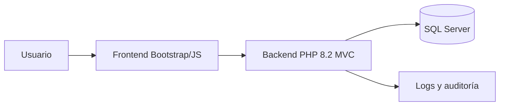
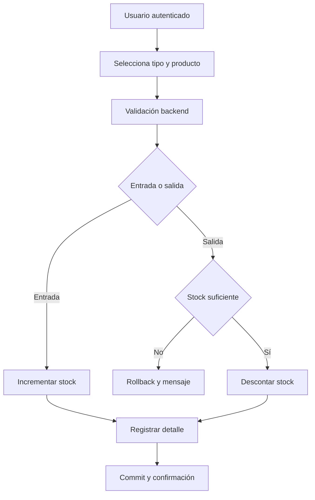

# Diagramas Mermaid

## Arquitectura

```mermaid
flowchart LR
    U[Usuario] --> F[Frontend Bootstrap/JS]
    F --> B[Backend PHP 8.2 MVC]
    B --> D[(SQL Server)]
    B --> L[Logs y auditoría]
```

## Flujo de inventario

```mermaid
flowchart TD
    A[Usuario autenticado] --> B[Selecciona tipo y producto]
    B --> C[Validación backend]
    C --> D{Entrada o salida}
    D -->|Entrada| E[Incrementar stock]
    D -->|Salida| F{Stock suficiente}
    F -->|No| G[Rollback y mensaje]
    F -->|Sí| H[Descontar stock]
    E --> I[Registrar detalle]
    H --> I
    I --> J[Commit y confirmación]
```
